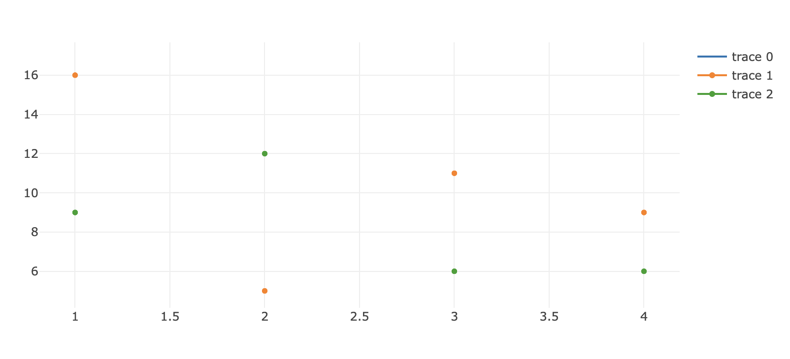

# Example Plotly.js app

This is a minimal app that demonstrates a bug with plotly.js v2.29.1. Simple run `npm install` and `npm run dev` to start the example.

After running this example, you should get a screenshot like below showing no line on trace0 and trace2, when there should be one. This is because the regl-line2d v3.1.2 package is installed instead of the v3.1.3 package.

This is because in v2.29.1 of plotly.js, it depends on `"^3.1.2"` of regl-line2d: https://github.com/plotly/plotly.js/blob/3c922716626ca33636d6569b2422d5f4986d1b6e/package.json#L113
However, there are changes made _after_ 3.1.2 to inline shaders: https://github.com/gl-vis/regl-line2d/commit/c3fefe2268b8d24fa4bb90cb374af90791ecf943
v2.29.1 expects these inline shaders, and should in fact depend on `^3.1.3`. instead.

With `regl-line2d@3.1.2` installed, you'll get the following warnings in the browser and lines will not draw:

```
WebGL: INVALID_OPERATION: drawArraysInstancedANGLE: no valid shader program in use
draw @ VM1313:344
REGLCommand @ plotly__js_lib_scattergl__js.js?v=eff02af6:16527
(anonymous) @ plotly__js_lib_scattergl__js.js?v=eff02af6:7083
Line2D.draw @ plotly__js_lib_scattergl__js.js?v=eff02af6:7067
draw @ plotly__js_lib_scattergl__js.js?v=eff02af6:3090
exports.redrawReglTraces @ chunk-IDUVTGCQ.js?v=eff02af6:5809
exports.drawData @ chunk-IDUVTGCQ.js?v=eff02af6:5775
lib.syncOrAsync @ chunk-O3K2MKXY.js?v=eff02af6:17324
_doPlot @ plotly__js_lib_core__js.js?v=eff02af6:1521
newPlot @ plotly__js_lib_core__js.js?v=eff02af6:1648
(anonymous) @ main.js:29
Show 9 more frames
Show less
WebGL: INVALID_OPERATION: useProgram: program not valid
```


